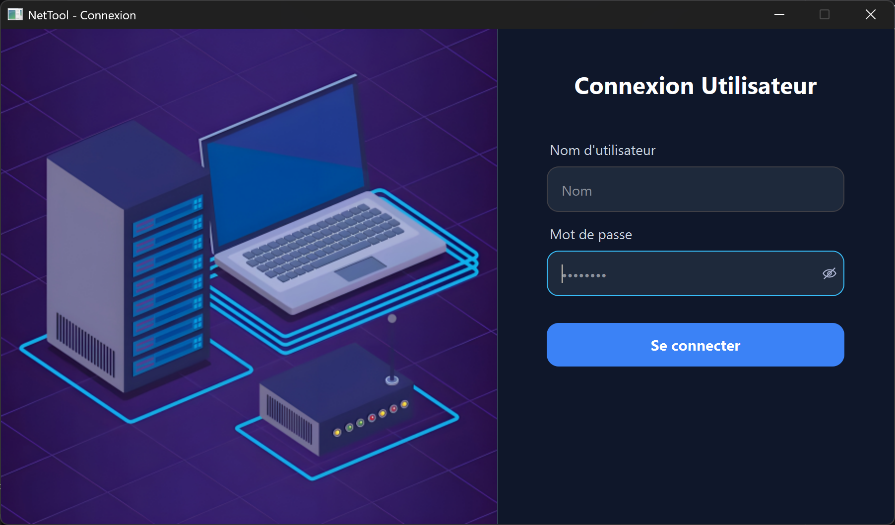
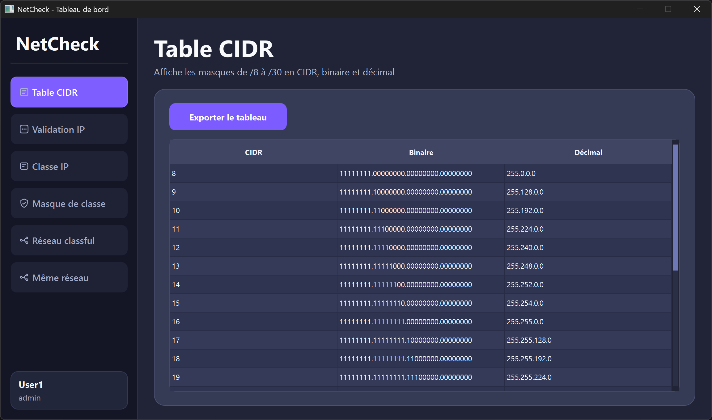
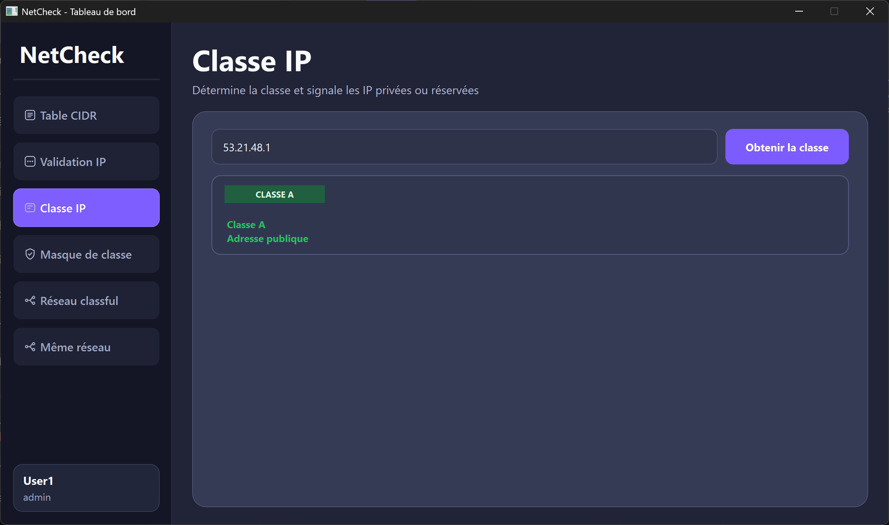
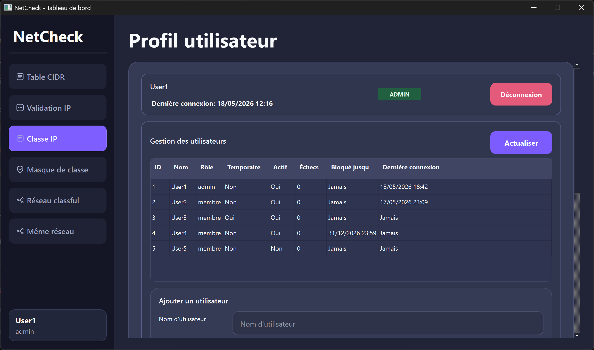

<h1 align="center">NetCheck</h1>

<a id="readme-top"></a>

<p align="center">
    
    
    
</p>

Application desktop pour calculer rapidement des informations reseau : validation d'IP, classe, masque, reseau/sous-reseau, verification de meme reseau et tableau CIDR.

<details>
    <summary>🗂️ Table of Contents</summary>
    <ol>
        <li>
            <a href="#🔎-overview">🔎 Overview</a>
        </li>
        <li>
            <a href="#📸-screenshots">📸 Screenshots</a>
        </li>
        <li>
            <a href="#🚀-getting-started">🚀 Getting Started</a>
        </li>
        <li>
            <a href="#🛠️-architecture-and-tech-stack">🛠️ Architecture and Tech Stack</a>
        </li>
        <li>
            <a href="#🤝-contributing">🤝 Contributing</a>
        </li>
        <li>
            <a href="#📝-license">📝 License</a>
        </li>
        <li>
            <a href="#👤-author">👤 Author</a>
        </li>
    </ol>
</details>

---

## 🔎 Overview

NetCheck facilite les calculs reseau courants via une interface PySide6, avec un tableau de bord multi-onglets et un panel admin pour la gestion des utilisateurs.

### Features

- Tableau complet des masques de /8 a /30 en notation CIDR, binaire et decimal pointe.
- Verification du format d'une adresse IP.
- Determination de la classe d'une IP, avec mention reservee/privee.
- Calcul du masque de classe associe a une IP.
- Determination du reseau et sous-reseau a partir d'une IP et de son masque (classfull).
- Verification bilaterale si deux IPs sont dans le meme reseau.
- Panel admin pour generer et gerer les utilisateurs.

<p align="right">(<a href="#readme-top">back to top</a>)</p>

## 📸 Screenshots

<table>
    <tr>
        <td>
            
        </td>
        <td>
            
        </td>
    </tr>
    <tr>
        <td>
            
        </td>
        <td>
            
        </td>
    </tr>
</table>

<p align="right">(<a href="#readme-top">back to top</a>)</p>

## 🚀 Getting Started

### Prerequisites

- Python 3.10+
- Docker + Docker Compose (pour la base PostgreSQL)

### Installation

1. Clone the repository:

    ```bash
    git clone https://github.com/Xen0r-star/NetCheck.git
    cd NetCheck
    ```

2. Create and activate a virtual environment:

    ```bash
    python -m venv .venv
    .\.venv\Scripts\Activate.ps1
    ```

3. Install dependencies:

    ```bash
    pip install -r requirements.txt
    ```

4. Start the PostgreSQL database:

    ```bash
    docker compose up -d
    ```

5. Run the application:

    ```bash
    python main.py
    ```

<p align="right">(<a href="#readme-top">back to top</a>)</p>

## 🛠️ Architecture and Tech Stack

### Architecture

- **Entry point** : main.py
- **Pages** : src/pages/
- **Views** : src/pages/views/
- **Services** : src/services/
- **Styles** : src/style/
- **Database init** : database/init.sql

### Tech Stack

- **Python** - Application logic
- **PySide6** - Desktop UI
- **PostgreSQL** - Database
- **Docker Compose** - Local DB setup

<p align="right">(<a href="#readme-top">back to top</a>)</p>

## 🤝 Contributing

Contributions are welcome! Feel free to open issues or submit pull requests.

1. Fork the repository
2. Create your feature branch (`git checkout -b feature/AmazingFeature`)
3. Commit your changes (`git commit -m 'Add some AmazingFeature'`)
4. Push to the branch (`git push origin feature/AmazingFeature`)
5. Open a Pull Request

<p align="right">(<a href="#readme-top">back to top</a>)</p>

## 📝 License

This project is licensed under the MIT License - see the [LICENSE](LICENSE) file for details.

<p align="right">(<a href="#readme-top">back to top</a>)</p>

## 👤 Author

GitHub: [@Xen0r-star](https://github.com/Xen0r-star)

<p align="right">(<a href="#readme-top">back to top</a>)</p>

---

Made with ❤️ by [Xen0r-star](https://github.com/Xen0r-star)
